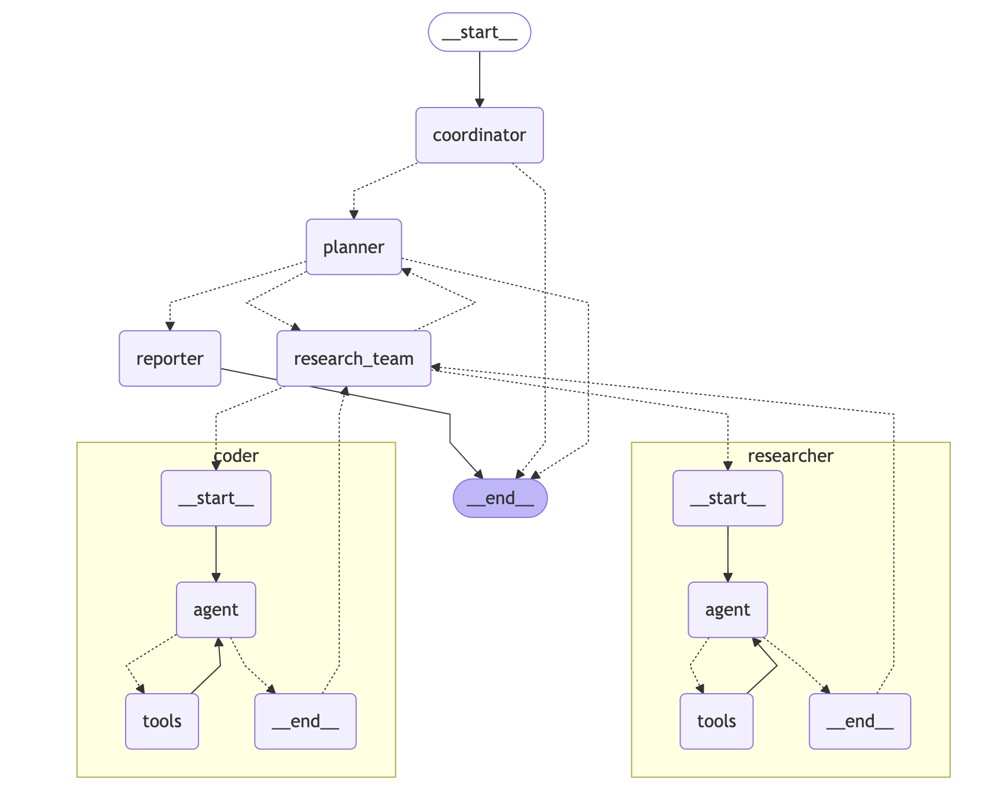

# lite-deep-researcher

[](https://www.python.org/downloads/)
[](https://opensource.org/licenses/MIT)

> Come from Open Source, Back to Open Source

lite-deep-researcher is a community-driven AI automation framework that builds upon the incredible work of the open source community. Our goal is to combine language models with specialized tools for tasks like web search, crawling, and Python code execution, while giving back to the community that made this possible.

## Quick Start

```bash
# Clone the repository
git clone https://github.com/hetaoBackend/lite-deep-researcher.git
cd lite-deep-researcher

# Install dependencies, uv will take care of the python interpreter and venv creation
uv sync

# Configure .env
cp .env.example .env

# Configure config.yaml
cp config.yaml.example config.yaml

# Run the project
uv run main.py
```

## Development

### Testing

Run the test suite:

```bash
# Run all tests
make test

# Run specific test file
pytest tests/integration/test_workflow.py

# Run with coverage
make coverage
```

### Code Quality

```bash
# Run linting
make lint

# Format code
make format
```

## Architecture

lite-deep-researcher implements a modular multi-agent system architecture designed for automated research and code analysis. The system is built on LangGraph, enabling a flexible state-based workflow where components communicate through a well-defined message passing system.



The system employs a streamlined workflow with the following components:

1. **Coordinator**: The entry point that manages the workflow lifecycle
   - Initiates the research process based on user input
   - Delegates tasks to the planner when appropriate
   - Acts as the primary interface between the user and the system

2. **Planner**: Strategic component for task decomposition and planning
   - Analyzes research objectives and creates structured execution plans
   - Determines if enough context is available or if more research is needed
   - Manages the research flow and decides when to generate the final report

3. **Research Team**: A collection of specialized agents that execute the plan:
   - **Researcher**: Conducts web searches and information gathering using tools like Tavily and web crawling
   - **Coder**: Handles code analysis, execution, and technical tasks using Python REPL tool
   Each agent has access to specific tools optimized for their role and operates within the LangGraph framework

4. **Reporter**: Final stage processor for research outputs
   - Aggregates findings from the research team
   - Processes and structures the collected information
   - Generates comprehensive research reports

## Examples

The following examples demonstrate the capabilities of lite-deep-researcher:

### Research Reports

1. **OpenAI Sora Report** - Analysis of OpenAI's Sora AI tool
   - Discusses features, access, prompt engineering, limitations, and ethical considerations
   - [View full report](examples/openai_sora_report.md)

2. **Google's Agent to Agent Protocol Report** - Overview of Google's Agent to Agent (A2A) protocol
   - Discusses its role in AI agent communication and its relationship with Anthropic's Model Context Protocol (MCP)
   - [View full report](examples/what_is_agent_to_agent_protocol.md)

3. **What is MCP?** - A comprehensive analysis of the term "MCP" across multiple contexts
   - Explores Model Context Protocol in AI, Monocalcium Phosphate in chemistry, and Micro-channel Plate in electronics
   - [View full report](examples/what_is_mcp.md)

4. **Bitcoin Price Fluctuations** - Analysis of recent Bitcoin price movements
   - Examines market trends, regulatory influences, and technical indicators
   - Provides recommendations based on historical data
   - [View full report](examples/bitcoin_price_fluctuation.md)

5. **What is LLM?** - An in-depth exploration of Large Language Models
   - Discusses architecture, training, applications, and ethical considerations
   - [View full report](examples/what_is_llm.md)

6. **How to Use Claude for Deep Research?** - Best practices and workflows for using Claude in deep research
   - Covers prompt engineering, data analysis, and integration with other tools
   - [View full report](examples/how_to_use_claude_deep_research.md)

To run these examples or create your own research reports, you can use the following commands:

```bash
# Run with a specific query
uv run main.py "What factors are influencing AI adoption in healthcare?"

# Run with custom planning parameters
uv run main.py --max_plan_iterations 3 "How does quantum computing impact cryptography?"

# Or run interactively
uv run main.py

# View all available options
uv run main.py --help
```

### Command Line Arguments

The application supports several command-line arguments to customize its behavior:

- **query**: The research query to process (can be multiple words)
- **--max_plan_iterations**: Maximum number of planning cycles (default: 1)
- **--max_step_num**: Maximum number of steps in a research plan (default: 3)
- **--debug**: Enable detailed debug logging

## License

This project is open source and available under the [MIT License](LICENSE).

## Acknowledgments

Special thanks to all the open source projects and contributors that make lite-deep-researcher possible. We stand on the shoulders of giants.

In particular, we want to express our deep appreciation for:
- [LangChain](https://github.com/langchain-ai/langchain) for their exceptional framework that powers our LLM interactions and chains
- [LangGraph](https://github.com/langchain-ai/langgraph) for enabling our sophisticated multi-agent orchestration

These amazing projects form the foundation of lite-deep-researcher and demonstrate the power of open source collaboration.
